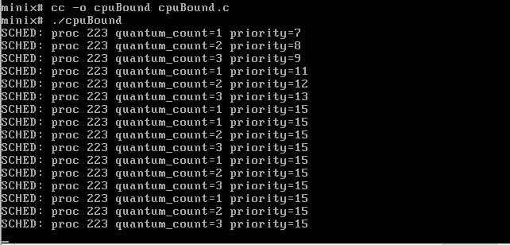
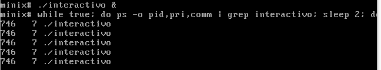

# Integrantes:

-Liz Cartaya Salabarría C211
-Maya Ramón Castellanos C212

# 1. Introducción

El presente proyecto se enmarca en la asignatura Sistemas Operativos de segundo año de la carrera Ciencia de la Computación. Su objetivo principal es el aprendizaje práctico mediante la implementación, modificación y análisis de componentes reales del sistema operativo, abordando aspectos como la gestión de procesos, la planificación de la CPU, la gestión de memoria, los mecanismos de concurrencia a través de hilos y el acceso al sistema de archivos mediante llamadas al sistema.

Como plataforma de trabajo se emplea MINIX 3. Su naturaleza modular y la disponibilidad de su código fuente permiten modificar, extender y analizar componentes internos reales, como el planificador de procesos, las bibliotecas de hilos y el sistema de entrada/salida.

El trabajo se estructuró en varios hitos que integran progresivamente los conceptos mencionados. Primero, personalizamos el mensaje de bienvenida del sistema. Luego, abordamos la depuración de un bug en la implementación de `pthread_mutex_trylock`, lo que requirió comprender la relación entre la capa de compatibilidad `pthread` y la implementación nativa `mthread` de MINIX. Implementamos el comando `tree`, que recorre recursivamente el sistema de archivos utilizando llamadas al sistema como `opendir`, `readdir` y `stat`. Finalmente, modificamos el planificador de MINIX para penalizar procesos con uso intensivo de CPU.

En las siguientes secciones se documentan detalladamente las decisiones de diseño, los cambios realizados en el código, las dificultades encontradas y las pruebas de validación ejecutadas para cada uno de estos componentes.

# 2.Desarrollo y resultados por componente

## 2.1. Instalación y configuración de VirtualBox y MINIX

### 2.1.1 Software utilizado

El proyecto se desarrolló sobre una laptop física con Ubuntu 24.04 LTS (sistema anfitrión). Sobre esta, se instaló Oracle VirtualBox 7.2.6 y se descargó la imagen ISO de MINIX 3.4.0 desde el sitio oficial.

Creamos una máquina virtual a la que nombramos Project Minix con MINIX 3 como sistema operativo invitado, con una memoria Ram de 2048 megabytes y con tres CPUs.

### 2.1.2 Instalación y Configuración

Instalamos, seguimos la configuración sugerida y quitamos el Iso de instalación.

Instalamos los binarios sugeridos y para eso primero actualizamos la lista de paquetes

```bash
minix# pkgin update
```

Instalamos git para poder trabajar con repositorios

```bash
minix# pkgin install git-base
```

Y siguiendo la documentación oficial utilizamos el siguiente comando para instalar lo mínimo necesario

```bash
minix# pkgin_sets
```

Procedemos a clonar el repositorio para poder obtener el código del sistema, para ello antes realizamos los comandos:

```bash
minix# cd /usr/src/
minix# pwd
```

y ya ubicados en esta carpeta clonamos el repositorio

```bash
minix# git clone https://github.com/MRCastellanos321/minix

```

Tenemos un problema con el cerificado de SSL que reolvemos de la siguiente manera

```bash
minix# git -c http.sslVerify=false clone https://github.com/MRCastellanos321/minix

```

Mientras se clonaba tuvimos un problema que impedía que el repositorio se clonara correctamente. Esto se debía a que el tamaño virtual de nuestra máquina era de solo 2048 megabytes y resultaba insuficiente. Para eso modificamos el espacio virtual a unos 8 Gb y volvimos a clonar el repositorio esta vez con éxito.

De esta forma ya quedó todo listo para trabajar, hacer cambios y compilar.

### 2.1.3 Reenvío de puertos

Para poder acceder a la máquina virtual desde la terminal de Ubuntu de forma cómoda, se configuró el reenvío de puertos en VirtualBox, redirigiendo el tráfico del puerto 2222 del host al puerto 22 del invitado (MINIX). De esta forma, es posible conectarse por SSH sin necesidad de abrir puertos adicionales en el sistema anfitrión.
Desde la interfaz gráfica de VirtualBox fuimos a: Settings -> Network -> Adapter 1 (NAT) -> Port Forwarding
y creamos una nueva regla con nombre: ssh, protocol: tcp, Host Port: 2222 y Guest Port: 22 .

Actualizamos el gestor de paquetes y se instalaron las herramientas necesarias para la compilación y edición:

```bash
minix# pkgin update
minix# pkgin install openssh
```

Configuramos el servidor SSH dentro de MINIX para permitir conexiones remotas:

```bash
minix# cp /usr/pkg/etc/rc.d/sshd /etc/rc.d/
minix# printf 'sshd=YES\n' >> /etc/rc.conf
minix# printf 'PermitRootLogin yes\n' >> /usr/pkg/etc/ssh/sshd_config
```

Creamos una contraseña de seguridad para permitir la conexión entre ambas terminales: `minix# passwd`

Iniciamos el servidor SSH en modo depuración:

```bash
minix# /usr/pkg/sbin/sshd -d
```

Finalmente, desde la terminal de Ubuntu, nos conectamos a MINIX:

```bash
ssh root@127.0.0.1 -p 2222
```

De esta forma podemos trabajar de manera más agradable desde la terminal de Ubuntu.

### 2.1.4 Carpeta compartida

Para facilitar la transferencia de archivos entre MINIX y Ubuntu, se configuró una carpeta compartida en VirtualBox.

Desde Ubuntu creamos la carpeta: `mkdir ~/minix_compartida `
Desde la interfaz gráfica de VirtualBox fuimos a: Machine -> Settings -> Shared Folders
y creamos una nueva carpeta compartida y le agregamos la ruta de la carpeta en Ubuntu, de nombre le pusimos "compartida" y marcamos las opciones "Automontar" y "Hacer permanente".

Por último, montamos la carpeta dentro de MINIX

```bash
minix# mkdir -p /mnt/compartida
minix# mount -t vbfs -o share=compartida none /mnt/compartida
```

## 2.2 Personalización del mensaje de bienvenida

Para completar esta tarea debimos modificar el mensaje de bienvenida tanto en el sistema MINIX de la máquina virtual como en el repositorio de git.
Siguiendo las indicaciones de la orientación del proyecto modificamos el archivo /etc/motd en MINIX utilizando el editor de texto vi.

```bash
minix# vi /etc/motd
```

Eliminamos el texto contenido en el archivo utilizando, dentro de vi, el comando `dd` que borra una línea completa. Luego escribimos nuestro mensaje personalizado:

```bash
Bienvenido a MINIX 3

Facultad de Matematica y Computacion
Universidad de La Habana
```

Guardamos el mensaje con el comando `:wq `y salimos del editor.

Reiniciamos la máquina virtual escribiendo reboot en la terminal y una vez que iniciada podemos ver el mensaje anterior.
Una vez modificado el mensaje en la máquina virtual para que el cambio se mantuviera en futuras compilaciones del sistema, replicamos la modificación en /usr/src/minix/etc/motd, que es el archivo fuente del mensaje de bienvenida.

```bash
minix# cp /etc/motd /usr/src/minix/etc/motd
```

Luego recompilamos el sistema y copiamos el archivo fuente recompilado a la carpeta compartida:

```bash
minix# cp /etc/motd /mnt/compartida/
```

desde la cual copiamos dicho archivo a la carpeta del repositorio en Ubuntu, para a subir los cambios.

## 2.3 Depuración de un bug en pthread

Creamos un archivo test_mutex.c con el programa de prueba de referencia que tenemos en la orientacion del proyecto y al compilar y ejecutar este test

```bash
minix# cd /root
minix# cc -o test_mutex test_mutex.c -lmthread
minix# ./test_mutex
```

notamos que el programa se queda colgado desde la primera llamada.

Para encontrar el error localizamos el archivo pthread_compat.c

```bash
minix# find /usr/src -name "pthread_compat.c" 2>/dev/null
```

Revisamos el codigo siguiendo la ruta antes encontrada

```bash
minix# nano /usr/src/minix/minix/lib/libmthread/pthread_compat.c
```

Allí pudimos ver el código de la función pthread_mutex_trylock

```bash
int pthread_mutex_trylock(pthread_mutex_t *mutex)
{
    if (PTHREAD_MUTEX_INITIALIZER == *mutex) {
        mthread_mutex_init(mutex, NULL);
    }

    return pthread_mutex_trylock(mutex);
}
```

y notamos que la función luego de crear un mutex, si no existe, se llama a sí misma recursivamente creando una recursión infinita y haciendo que el programa quede colgado, en su lugar debería llamar al método mthread*mutex_trylock.
Esto se debe a que pthread es un estándar de programación para manejo de hilos (threads) en sistemas UNIX, pero MINIX no implementa pthread de forma nativa, sino que tiene su propio sistema de hilos llamado mthread (Minix Threads).
Para permitir la ejecución de programas escritos para el estándar pthread, MINIX incorpora una capa de compatibilidad en el archivo pthread_compat.c. Esta capa funciona como traductor, expone las funciones pthread*\_ y redirige las llamadas a las funciones equivalentes de mthread\_\_.

Cambiamos el código:

```diff
 int pthread_mutex_trylock(pthread_mutex_t *mutex)
 {
     if (PTHREAD_MUTEX_INITIALIZER == *mutex) {
         mthread_mutex_init(mutex, NULL);
     }
-    return pthread_mutex_trylock(mutex);
+    return mthread_mutex_trylock(mutex);
 }
```

Compilamos solo la biblioteca libmthread e instalamos la biblioteca compilada en el sistema (/usr/lib) para que los cambios reemplazaran versiones antiguas.

```bash
minix# cd /usr/src/minix/lib/libmthread
minix# make
minix# make install
```

Volvimos a compilar y ejecutar el test que creamos

```bash
minix# cd /root
minix# cc -o test_mutex test_mutex.c -lmthread
minix# ./test_mutex
```

y pudimos ver que obtuvimos las respuestas esperadas.

```bash
first trylock: 0 (OK)
second trylock: 11 (Resource deadlock avoided)
unlock: 0 (OK)
destroy: 0 (OK)
PASS
```

Para confirmar el significado del valor 11, consultamos el archivo /usr/include/sys/errno.h, donde comprobamos que en esta versión de MINIX la constante EDEADLK (Resource deadlock avoided) está definida con el valor 11.

## 2.4 Implementación del comando tree

Para crear el comando tree, accedemos a la carpeta commands en el código fuente de minix y creamos un nuevo directorio para contener el mismo. Creamos un archivo donde programaremos el comando en c y dentro comienza la implementación. 

### Diseno de algoritmo e Indentación:

La idea del programa es recorrer recursivamente a partir de la ruta dada (o "." en caso de que no haya parametro para el tree) cada carpeta y listarlas a ellas y sus archivos. El main que va a ser el punto de entrada nos permite ver la ruta decidida por el usuario a traves del argc y el argv. La función "abrirRuta" es la que se llamará a sí misma de forma recursiva. La recursividad permite que en cada ruta donde se analicen las carpetas y archivos, sea posible llamarla sobre el nuevo directorio de las carpetas, y llevar a través de la variable requerida como parámetro "nivel" un tamano de indentación para imprimir cada nombre de forma espaciada de acuerdo a su profundidad.

### Llamadas al sistema:

Utilizamos las funciones que importamos con `#include <dirent.h>` y `<sys/stat.h>`:

```bash
closedir(); recibe un *DIR y cierra el directorio abierto que apunta

opendir(); abre un directorio (recibe un texto ruta y devuelve un *DIR)

readdir(); recibe un *DIR y devuelve un *struct dirent

lstat(); recibe Ruta (texto) y puntero a struct stat, devuelve 0 al éxito y -1 al fallo. Lee los metadatos de un archivo (tipo, tamaño, permisos, propietario, fechas, etc.) y los guarda en una estructura struct stat.

```

### Prevención de ciclos.

Se tiene en cuenta como requerido en la orientación comprobar los enlaces simbólicos, los cuales pueden causar bucles infinitos. Un enlace simbólico es un puntero virtual a otro directorio que en casos especiales puede causar un ciclo interminable (si apunta a la carpeta que lo contiene o un ancestro, esta se va a abrir por la función y encontrarse de nuevo con el enlace simbolico, recorriendo la misma ruta una y otra vez, por ejemplo). Los detalles de su manejo se encuentran a continuación en código.

### Código:

Comenzamos con main. Si la cuenta de argumentos es >1, pasamos la ruta indicada por el usuario como parámetro para al primer llamado de la función "abrirRuta", de lo contrario es el directorio actual.

```bash
char *primeraRuta = ".";
 if(argc > 1)
  {
   primeraRuta = argv[1]; 
  }
  printf("%s\n",primeraRuta);
  abrirRuta(primeraRuta, 0);
```

También debemos  manejar errores (no hay permisos para el archivo, etc) Por ello comprobamos que el intento de obtener el *DIR  a través de `opendir()` no haya fallado:

```bash
DIR *directorioabierto = opendir(ruta);
 if (directorioabierto == NULL)
  {
  printf("Error");
  return;
  }
  struct dirent *nombreActual;
  while ((nombreActual = readdir(directorioabierto)) != NULL)
{
char *nombre = nombreActual->d_name;

...

}
```
En este caso readdir devuelve un puntero al struct dirent, nombreActual, llamado así por conveniencia, y es lo que da acceso a propiedades como d_name que vamos a usar para imprimir los nombres de archivos y carpetas en la terminal.

 En la función se pasa a se comprobar los archivos de inicio "." (pues son los especiales normalmente invisibles del sistema) para no imprimir los nombres de estos.
 
 Tenemos en cuenta los enlaces simbólicos. Para prevenir el caso de un bucle infinito: 

```bash
char rutaCompleta[1024];
 snprintf(rutaCompleta, sizeof(rutaCompleta), "%s/%s", ruta, nombre);

 struct stat rutacomprobacion;
  if (lstat(rutaCompleta, &rutacomprobacion) == -1)
    {
      continue;
    }
  if (S_ISLNK(rutacomprobacion.st_mode))
    {
      printf("%s\n", nombre);
      continue;
    }
 ```
 En este fragmento de código concatenamos mediante snprintf (que no imprime en pantalla sino que guarda en string) para guardar en rutaCompleta la unión de ruta y nombre, permitiendo así pasarle a lstat la ruta completa que requiere de parámetro. Declaramos la variable tipo struct stat rutacomprobacion, que lstat rellena con los metadatos de rutaCompleta, para así poder usar la macro `S_ISLNK(rutacomprobacion.st_mode)` que va a evaluar como true en caso de que sea un enlace simbolico, permitiéndonos imprimir el nombre y continuar a la siguiente iteracion del ciclo mientras ignoramos el enlace.

 Por último:

```bash
 DIR *prueba = opendir(rutaCompleta);
  if (prueba != NULL) 
  {  closedir(prueba);
     printf("%s\n",nombre);
     abrirRuta(rutaCompleta, nivel +1);
  } 
  else 
  {
     printf("%s\n",nombre);
  } 
```
 Acá se tiene en cuenta si lo obtenido en rutaCompleta se trata de una carpeta o archivo (si es una carpeta, no es dará NULL el if), esto es puesto que en el primer caso hay que adentrarse recursivamente en la carpeta tras imprimir su nombre, mediante un llamado a abrirRuta usando como parámetro este directorio. Aumentamos nivel en 1 para imprimir a más profundidad, y concluimos con `closedir()`
 
El árbol también requiere de un archivo Makefile, el que usamos para compilar el sistema con el nuevo comando y ponerlo en funcionamiento.


#Ejemplos de ejecución

A continuación las imágenes resultados de llamar al comando tree para el directorio actual, para una ruta relativa y para una absoluta. En todas podemos ver que el "enlace_a_carpeta" (simbólico) no fue seguido hacia la carpeta "EnlaceApuntaAqui", y que los niveles fueron impresos con indentación.

.png)
.png)
.png)

## 2.5 Penalización por uso intensivo de CPU

### Análisis previo:

Los diferentes procesos del sistema están en constante demanda de cpu para su funcionamiento, como pide la orientación, debemos modificar la forma en que la cpu se administra, implementando una penalización en los programas por su uso excesivo. Para ello accedimos a servers/sched en el código fuente. Aquí se encuentra sched.c, el que va a contener las funciones necesarias para el trabajo, `do_noquantum(), balance_queues()`, `do_start_scheduling()` y `do_stop_scheduling()`, y schedproc.h que también necesitaremos modificar. Vemos la existencia de la variable priority y max_priority para cada proceso. Funciona de esta forma: una mayor priority indica que la prioridad del sistema para este proceso es menor, o sea que al aumentar "priority" para un proceso en realidad estamos disminuyendo su prioridad para que no acapare cpu, usando los quantums como medida.

### Diseno de política:

Tras la conclusión de las modificaciones, cada N=3 quantums consumidos, un proceso es penalizado en priority++. Elegimos N=3 como sugerido en la orientación porque es buen balance entre una penalización demasiado agresiva y una que tarda demasiado en aplicarse. 

Observemos ahora la línea existente en sched.c : `#define BALANCE_TIMEOUT 5 /* how often to balance queues in seconds */.` y en int_scheduling: `balance_timeout = BALANCE_TIMEOUT * sys_hz(); sys_setalarm(balance_timeout, 0);` De aquí sabemos que el `balance_queues()` se llama cada 5s.

Por eso implementamos de forma tal que las ventanas de intervalo aprovechan la estructura ya existente del llamado a `balance_queues()` para tener los cinco segundos cada los cuales esta función es llamada como su tamano, así no es necesario definir nuevos contadores y se modifica el código en lo mínimo. En esta parte si al concluir ese tiempo (la función es llamada) el proceso tiene quantum_count = 0 y no ha alcanzado su max_priority, entonces recupera su prioridad (priority--), puesto que no se ha estado comportando como un proceso abarcador de cpu, e independientemente, quantum_count vuelve a ser 0.

### Cambios Realizados:

Iniciamos modificando el archivo schedproc.h para añadir la variable quantum_count, que utilizaremos para la condición < N quantums (en este caso elegimos 3 como el ejemplo) Ahora quantum_count es accesible desde rmp en el código.

Vamos al archivo sched.c donde están las funciones que vamos a modificar. Primeramente, el objetivo es aplicar una penalización gradual a los programas que alcancen los 3 quantums y superior, para ello cuanto rmp->quantum_count es mayor que 3 aumentamos en +1 su "priority". Comprobamos también que el aumento no supera el MIN_USER_Q definido por el sistema y reseteamos la cuenta de quantums a 0 una vez concluido esto. Queda modificado el código de `do_noquatum()`con este segmento anadido:

```bash
if (rmp->quantum_count >= 3) 
    {
	   if (rmp->priority < MIN_USER_Q) 
                {
                  rmp->priority++;
                }
               rmp->quantum_count = 0;
	}
```
`do_noquatum()`es la función que es llamada cuando un proceso agotó su quantum. Cada proceso recibe un quantum, que es un tiempo de cpu máximo otorgado por el sistema. Cuando el timer del kernel detecta que este llegó a cero, envía un mensaje al scheduler, el cual entonces llama a esta función.

La función `balance_queues()`por otra parte se va a encargar de balancear. Anteriormente, cada 5 segundos recorría todos los procesos del sistema y si su prioridad era peor que max_priority, la subía en un nivel. Tras la modificación, si un proceso tiene su cuenta de quantum en 0 (es decir que no se comportó como un proceso intensivo durante esa ventana) y su priority es mayor(peor) que max_priority entonces disminuimos priority (o sea aumentamos su prioridad), además al concluir la ventana temporal se reinicia la cuenta de quantums a cero, de esa forma usamos el mecanismo ya existente de temporización. Queda este segmento modificado:

```bash
if (rmp->flags & IN_USE) {
			if (rmp->quantum_count == 0 && rmp->priority > rmp->max_priority) {
				rmp->priority -= 1;
				schedule_process_local(rmp);
			}
		}
		rmp->quantum_count = 0;
```
Por último, `do_stop_scheduling` resetea la cuenta de los quantums a cero, y `do_start_scheduling()` la inicia ahí.

Una vez hechas estas modificaciones recompilamos el sistema con make y podemos verlo en funcionamiento con las pruebas descritas por la orientación.

### Validación experimental:

Para ambos casos creamos un código en c en la carpeta pruebas, y nos servimos de los comandos cc -o cpuBound cpuBound.c y ./cpuBound, el primero lo compila usando cc y el segundo lo ejecuta. En una segunda terminal, el comando `top () `(con | grep cpuBound para encontrar la línea) nos permitió ver el progreso de la penalización para la primera prueba (el loop infinito) que agota quantums sin terminar nunca y por ello es penalizado hasta priority 15. La segunda prueba, el proceso bloqueante no recibe ninguna penalización a su prioridad, porque usa `sleep()` cada cierto tiempo y por tanto no es categorizado como un proceso cpu bound o intensivo para la cpu, ya que la está cediendo cada vez que se bloquea. También anadimos un printf opcional en el codigo sched.c (en `do_noquantum()`) para ver mejor el aumento de la penalización en el tiempo sin necesidad de los comandos anteriores para el primer caso y mostrar la imagen a continuación.

Imágenes(capturas de terminal en minix que muestran la evolución de la prioridad):



# 3.Resultados globales y discusión

Concluido el proyecto todas las componentes y cambios implementados funcionan satisfactoriamente, por lo que se ha cumplido la meta, y no encontramos diferencias al resultado esperado. Se superaron las dificultades técnicas iniciales de espacio y conectividad para preparar el ambiente de trabajo. Aprendimos más acerca de la estructuración interna de un sistema operativo, la programación de comandos de terminal a bajo nivel, el manejo y distribución de cpu para los programas y lo que hacen algunas de las funciones esenciales para este diseno, nos familiarizamos con el uso de comandos de terminal nuevos y conocidos a lo largo de la realización del proyecto, así como con varios aspectos del lenguaje c.

# 4. Conclusiones

El desarrollo del presente proyecto nos ha permitido cumplir con los objetivos propuestos, abordando principios fundamentales de los sistemas operativos como la gestión de procesos, la planificación de la CPU, la concurrencia mediante hilos y el acceso al sistema de archivos. MINIX 3 resultó ser una plataforma de estudio adecuada, gracias a la disponibilidad de su código fuente, lo que facilitó la modificación y análisis de componentes internos reales.

Cada uno de los hitos planteados se completó satisfactoriamente:

- Se **personalizó el mensaje de bienvenida:** modificando el archivo `/etc/motd` y replicando el cambio en el código fuente, logrando que el mensaje personalizado apareciera al iniciar sesión.

- Se **depuró el bug en `pthread_mutex_trylock`:** identificando que la función se llamaba recursivamente a sí misma. La corrección consistió en reemplazar la llamada recursiva por `mthread_mutex_trylock`, resolviendo así el bloqueo del programa de prueba. El programa validó el comportamiento esperado, devolviendo `0` en la primera llamada y `EDEADLK` (código 11) en la segunda.

- Se **implementó el comando `tree`:** desarrollando un comando que recorre recursivamente el sistema de archivos utilizando llamadas al sistema (`opendir`, `readdir`, `closedir`, `stat`), aplicando indentación según el nivel de profundidad y evitando seguir enlaces simbólicos para prevenir ciclos.

- Se **modificó el planificador:** incorporando un contador de quantums por proceso e implementando una política de penalización por uso intensivo de CPU, basada en ventanas de tiempo. La validación experimental mostró una clara diferencia de tratamiento entre procesos CPU-bound (penalizados hasta prioridad 15) y procesos interactivos (sin penalización), cumpliendo con los criterios establecidos.

Gracias a este proyecto aprendimos en la práctica cómo funcionan la planificación por prioridades, la concurrencia con hilos y el acceso de bajo nivel al sistema de archivos. En definitiva, la experiencia adquirida resulta de gran valor para nuestra formación en la carrera, al integrar conceptos teóricos con la modificación práctica de un sistema operativo real.

# 5. Referencias consultadas

Guerra, C. (2026). _Setup inicial de MINIX_ [Video]. Grupo de Sistemas Operativos 25-26, Universidad de La Habana.

MINIX 3. (2016). _Installing MINIX 3_. MINIX 3 Wiki. Recuperado de https://wiki.minix3.org/doku.php?id=usersguide:doinginstallation

MINIX 3. (2018). _Download_. MINIX 3 Wiki. Recuperado de https://wiki.minix3.org/doku.php?id=www:download:start

# 6. Declaración de uso de IA

Fue utilizada como:

Ayuda inicial para interpretar ciertos errores durante el proceso de instalación, como problemas de conectividad o de espacio para clonar y ejecutar el make.

Asistencia para lograr conectar las terminales de minix y Ubuntu mediante SSH.

Ayuda para conocer el uso exacto de varios comandos necesarios para la edición o supervisión de procesos en la terminal (cp, grep, top, etc, modo de compilar con cc, etc).

Para mayor comprensión de la relación entre `pthread` (capa de compatibilidad) y `mthread` (implementación nativa de MINIX).

Asistencia para resolver conflictos al hacer `git pull` y `git push`, y para manejar el token de autenticación.

En desconocimiento de qué funciones podían utilizarse para tareas como comprobar si algo se trataba de un enlace simbólico, y entender que hacían, recibían y devolvían las funciones que trabajaban con los directorios, y la biblioteca que incluir.

Para comprobar errores o la falta de ellos de sintaxis en c (ejemplo: falto un ;).

Asistencia con la interfaz de virtualbox (ejemplo: como crear un snapshot de tu estado actual para salvagardarlo).

Para entender las funciones originales de do_no_quantum y balance_queues y cuál era el archivo donde definía los campos de variable para rmp para poder definir quantum_count.

Ayuda con la redacción de las referencias para este informe, siguiendo el formato APA, así como en la revisión de estilo y corrección de errores tipográficos en el resto del informe.

